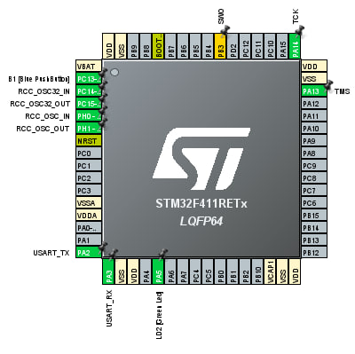
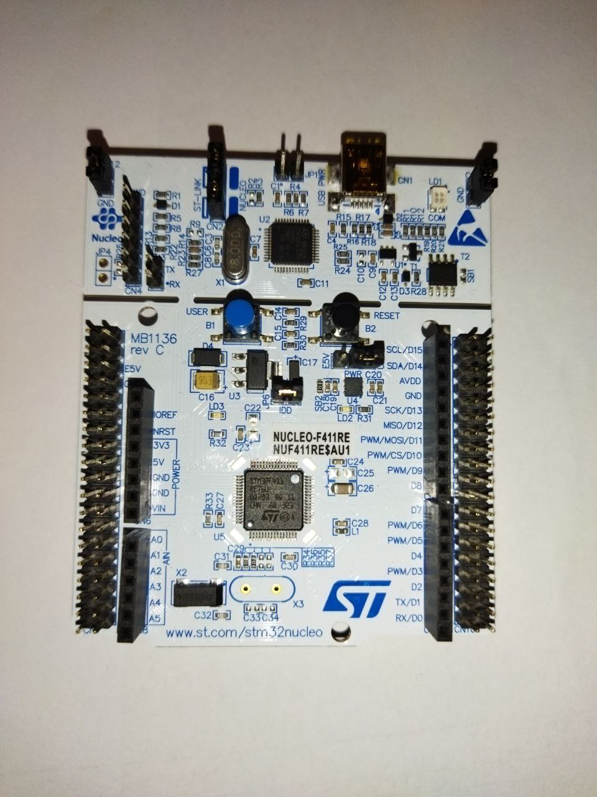

# UART LED Control Project  

This project demonstrates how to control an LED using UART communication. The system allows you to send commands (`on`, `off`, `blink`) via a terminal program (e.g., PuTTY) to control the state of an LED connected to the **NUCLEO-F411RE** microcontroller.

---

## 📜 Table of Contents  
- [Introduction](#introduction)  
- [Features](#features)  
- [Hardware Components](#hardware-components)  
- [Circuit Diagram](#circuit-diagram)  
- [Software Description](#software-description)  
- [Getting Started](#getting-started)  
- [Commands and Functionality](#commands-and-functionality)  
- [Future Improvements](#future-improvements)  
- [License](#license)  

---

## 📝 Introduction  

This project uses UART communication to send commands from a computer to an STM32 microcontroller to control an LED. The project is a great way to learn about UART communication, GPIO control, and embedded programming basics.  

---

## 🌟 Features  

- **UART Communication**: Send commands via UART using a terminal (e.g., PuTTY).  
- **LED Control**:  
  - `on`: Turns the LED on.  
  - `off`: Turns the LED off.  
  - `blink`: Makes the LED blink at a defined interval.

---

## 🛠 Hardware Components  

- **NUCLEO-F411RE** (STM32 microcontroller board)  
- **USB Cable** (for power and UART communication)  
- **Computer with PuTTY or any UART terminal program**  

---

## 📟 Circuit Diagram  


1. **UART**:  
   - Use the onboard ST-LINK interface for UART communication via the micro-USB cable.  

> The onboard LED (LD2) on the NUCLEO-F411RE is preconnected to PA5 and can be used directly.  

---

## 💻 Software Description  

The project is implemented in **STM32CubeIDE** using HAL libraries.  

### Core Functionalities:  

1. **UART Initialization**:  
   Configured UART at 115200 baud rate with 8-N-1 configuration.  

2. **Command Parsing**:  
   - The STM32 microcontroller listens for UART data from the terminal.  
   - Parses received strings (`on`, `off`, `blink`) to control the LED.  

3. **LED Control**:  
   - `on`: Turns the LED on.  
   - `off`: Turns the LED off.  
   - `blink`: Blinks the LED with a 1-second interval.  

---

 ## Developers
 
[y.kovalchuk](https://github.com/job-space)

## License

Project NUCLEO-UART-CONTROL-LED is distributed under the MIT lisense.

## 🚀 Getting Started  

### 1. Clone the Repository  
```bash  
git clone https://github.com/yourusername/uart-led-control.git  
cd uart-led-control  
